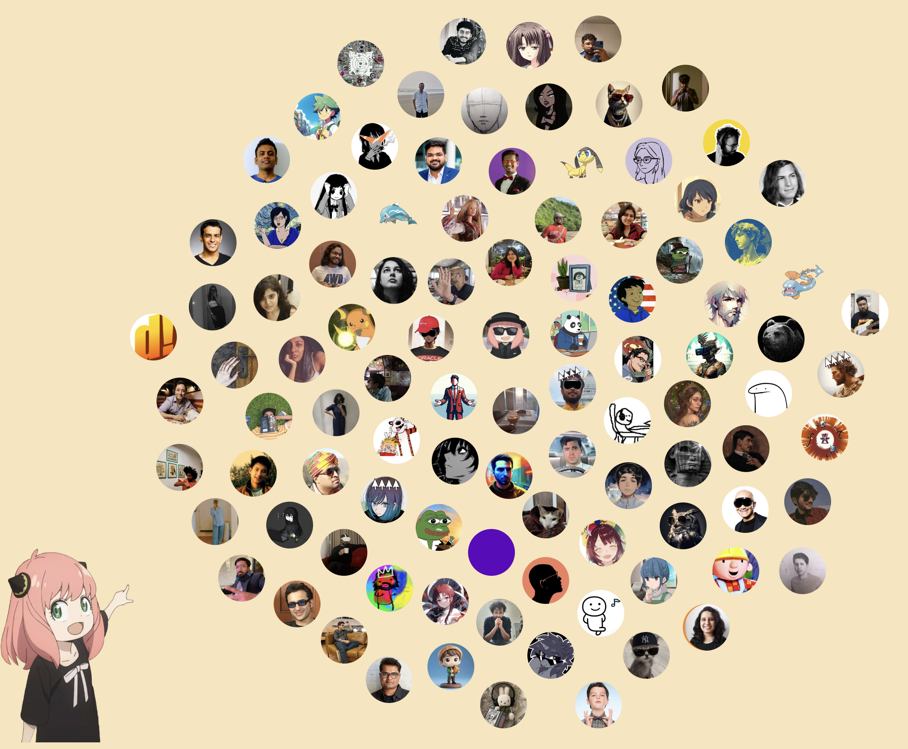

# Twitter Circle (README is work in progress)




## A tool to visualize your Twitter network and direct messaging history

## Features

>Make a Twitter Circle visualization
>Check leaderboard based on combined weights of your mentions and direct messages
>Check DM stats like messages sent/recieved per user, total messages, last message with them
>DM bar graph where you can see messages/month for 5 years data

### Setup

1. Clone the repository:
   ```
   git clone https://github.com/sankalp1999/twitter-circle.git
   ```

2. Copy your Twitter archive into the project folder and rename the archive/zip file `twitter-archive`


3. Install Node.js (for Linux and macOS):
   - Visit the official Node.js website: https://nodejs.org
   - Download the appropriate version for your operating system
   - Follow the installation instructions provided on the website

   For Windows:
   - Visit the official Node.js website: https://nodejs.org
   - Download the Windows installer
   - Run the installer and follow the installation wizard

4. Install project dependencies:
   ```
   npm install
   ```
   This command will install all the necessary packages listed in the `package.json` file.

5. Set up the project (Linux and macOS):
   ```
   chmod +x setup.sh
   ./setup.sh
   ```
   This will make the `setup.sh` script executable and run it to set up the project.


6. Start the application:
   ```
   npm start
   ```
   This command will start the Twitter Circle application.


### Open to feedback

Let me know in the DMs or maybe PRs. I don't primarily write JS so open to suggestions
to make the code or UI better.

### Flow of execution


`extract_mentions_and_dump.js` - Extracts the mentions that are based on *your* replies and quote tweets. some 
power law decay with a linear time in denominator to smoothen it are calculated. weights are stored
in mentions_count_folder

at the start of file, you can see I am creating a mapping from accountId / user id to username and vice-versa
this helps to avoid scraping. this will work if you have replied to the person atleast once otherwise
their accountId won't be known (and we won't be able to map from DM to here)

`preprocess_direct-messages.js` - extract dm, process *all* messages except the gc ones, get basic stats, calculate DM weights based on same function that we applied earlier and add them to existing weights.

`pfp_fetch_and_id_correction.js` - get the profile pictures using puppeteer from sotwe dot com, get profile banner
if id was not found earlier, use profile banner to get accountID and correct it for topN people

`direct-messaging-stats/dm_final_stats_processing.js` - processes conversation to enable drawing graph 
available by clicking on fields in the dm stats file

### Known Bugs
- You may see some @notfound_userid in the stats table