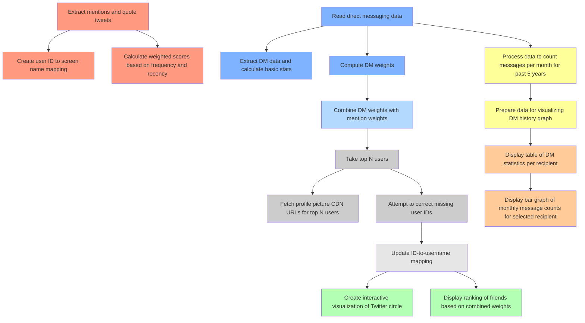
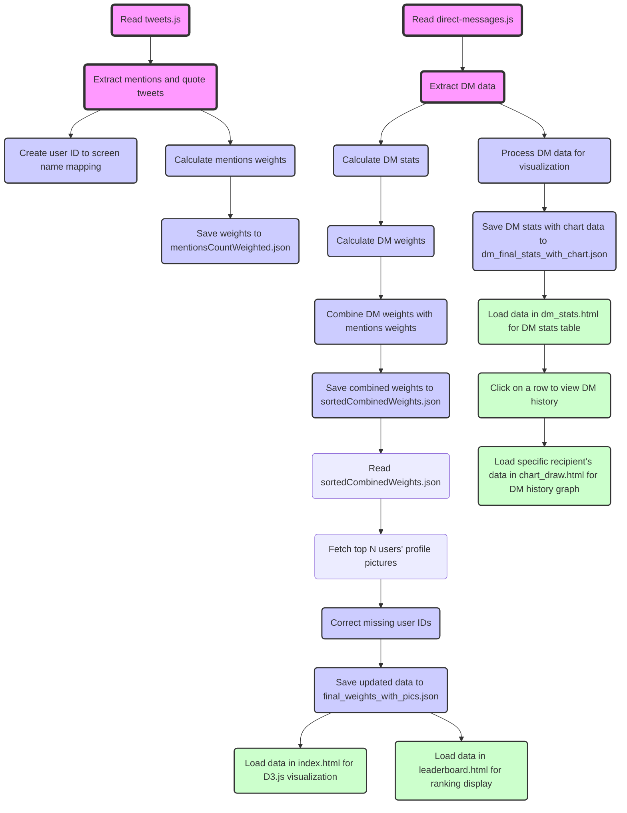

# Twitter Circle


## A tool to visualize your Twitter network and direct messaging history

### Features

1. **Make a Twitter Circle visualization** for up to 200 users.
2. **Check leaderboard** based on combined weights of *all* your mentions of other users and *all* direct messages.
3. **Check DM stats** message count per recipient, messages sent/received per user, total messages, last message with them
4. **DM bar graph** where you can see messages/month for 5 years data.


## Table of Contents

1. [Twitter Circle](#twitter-circle)
   - [Features](#features)
   - [Setup](#setup)
   - [Troubleshooting](#troubleshooting)
2. [Share screenshots and tag your inner circle!](#share-screenshots-and-tag-your-inner-circle)
3. [How Twitter Circle Works](#how-twitter-circle-works)
   - [Tech stack](#tech-stack)
   - [Relevant files used from Twitter archive](#relevant-files-used-from-twitter-archive)
   - [Flow of execution](#flow-of-execution)
     1. [extract_mentions_and_dump.js](#1-extract_mentions_and_dumpjs)
     2. [preprocess_direct-messages.js](#2-preprocess_direct-messagesjs)
     3. [pfp_fetch_and_id_correction.js](#3-pfp_fetch_and_id_correctionjs)
     4. [dm_final_stats_processing.js](#4-dm_final_stats_processingjs)
     5. [index.html](#5-indexhtml)
     6. [leaderboard.html](#6-leaderboardhtml)
     7. [dm_stats.html](#7-dm_statshtml)
     8. [chart_draw.html](#8-chart_drawhtml)
   - [Solving for username to user id mapping without scraping](#solving-for-username-to-user-id-mapping-without-scraping)
   - [Bugs and Limitations](#bugs-and-limitations)


### Setup


If you have already cloned, please do a `git pull`

1. **Download your Twitter archive.**

   - Go to: `More (3 dot button) > Settings and Privacy > Your Account > Download an archive of your data`.
   - Note: It takes around 1-2 days for Twitter to prepare your archive data.

   **Clone the repository:**

   ```bash
   git clone https://github.com/sankalp1999/twitter-circle.git
   ```

2. **Copy your Twitter archive (extracted folder, not the zip file) into the project folder and rename the extracted folder to `twitter-archive`.** You have to ensure the archive is on the root folder of the project.

3. **Install Node.js (for Linux and MacOS)**

   - Visit the official Node.js website: <https://nodejs.org>
   - Download the appropriate version for your operating system.
   - Follow the installation instructions provided on the website.

4. **Install project dependencies**

   ```bash
   npm install
   ```

   This command will install all the necessary packages listed in the `package.json` file.

5. **Set up the project**

   ```bash
   ./setup.sh
   ```

   For **Windows**, you will require git bash or WSL to run above bash script.

6. **Start the application**

   ```bash
   npm start
   ```

   This command will start the Twitter Circle application. **Share screenshots of your top 100 now! If you liked it, please star the repo.**


   

### **Troubleshooting :**

 First step if not working, do a `git pull` and just re-run the script `./setup.sh`

 If still not working, raise an issue or contact me [https://twitter.com/dejavucoder](https://twitter.com/dejavucoder) 


#### Known Issues

**Update 16th June**

Most problems will happen at the scraping stage. I don't directly scrape profile pics from Twitter.
I currently scrape from muskviewer.com. You should be able to scrape once properly. If you try
a second scrape immediately, then you may get rate limited.

Earlier I was using twstalker.com which now has cloudfare bot detection. If you could help me get 
around this, I am open to a PR.

1. The frontend tweet webviewer website may be down. you can check by twstalker.com/your_user_name. In this case, you can try
later or try changing line 146 in `pfp_fetch_and_id_correction.js`. `if (isReachablePrimary)` to `if (false)`

2. Profile pictures not rendering 

   a. Browser dependencies are missing - check https://pptr.dev/troubleshooting

   For Linux, WSL etc. check [here](https://pptr.dev/troubleshooting#running-puppeteer-on-wsl-windows-subsystem-for-linux).

   Error may look like below (it's from WSL)

   ``` 
   UnhandledPromiseRejectionWarning: Error: Failed to launch the browser process!

   /your_username/.cache/puppeteer/chrome-linux-122.0.6261.69/chrome-linux/chrome: error while loading shared libraries: libatk-1.0.so.0: cannot open shared object file: No such file or directory


   TROUBLESHOOTING: https://pptr.dev/troubleshooting 
   ```

   b. Browser launch process fail because chromium path not set (Linux, M1 Macs)
   
   Find your chromium path and please set it like below example

   around line 211 in `pfp_fetch_and_id_correction.js`

   ```
   const browser = await puppeteer.launch({ headless: true, args: ['--no-sandbox', '--disable-setuid-sandbox'], executablePath: 'usr/bin/chromium-browser' })
   ```

   
2. **Chrome or Safari** are recommended. Edge has CORS issue.

## Share screenshots and tag your inner circle!

**Don't forget to share screenshots** of your top 50, 100 whatever you feel like

Tag your inner circle in reply

**Zoom out** browser enough to let the images fit in and please exclude slider
for better screenshot.

If you are feeling courageous, I dare you to share your DM stats leaderboard screenshots.


## How Twitter Circle Works

### Tech stack

- Vanilla HTML/CSS/JS
- Puppeteer to get profile pictures
- D3.js for drawing the twitter circle
- chart.js for drawing the graphs

Tried to keep complexity and dependencies at minimum

### Relevant files used from Twitter archive

- `account.js` - Details of your account like accountId and userhandle/screenname 
- `tweets.js` - All your tweets (normal tweet, replies, quote tweets) with data like reply mentions, quote tweet url, text, media url
- `direct-messages.js` - All your personal messages, no group chat messages





### Flow of execution



1. `extract_mentions_and_dump.js`:
   - Reads `tweets.js` from the user's Twitter archive.
   - Extracts mentions and quote tweets from the tweet data.
   - Creates a mapping between user IDs and screen names and saves it to `user_mentions_screen_name_mapping.json`.
   - Calculates weighted scores based on the frequency and recency of interactions and saves them to `mentions_count_folder/mentionsCountWeighted.json`.

   Scores are based on *your* replies and quote tweets. I sum up the mentions and apply a weighing mechanism based on time difference to ensure the relevance of interactions. Recent interactions get slightly more weightage. This is because we perceive people we interacted with recently to be closer to us - the time weight heuristic is provided to account for the recency bias

   The mapping between user IDs and screen names is to avoid scraping. This mapping is required as the direct messaging data contains only accountIds (and no usernames)
   
   The mapping will work if you have replied to the person at least once otherwise their accountId won't be known. There is a scraping workaround but I avoid it as it takes time plus want to keep scraping at minimum. see `utils/fetch_user_id_to_user_name.js`

2. `preprocess_direct-messages.js`:
   - Reads `direct-messages.js` from the user's Twitter archive.
   - Extracts direct messaging data and processes *all* of it to calculates basic stats (total messages, messages sent/received per user).
   - Computes DM weights using a weighing mechanism similar to the mentions.
   - Combines the DM weights with the existing weights from `mentions_count_folder/mentionsCountWeighted.json` and saves the result to `sortedCombinedWeights.json`.

3. `pfp_fetch_and_id_correction.js`:
   - Reads `sortedCombinedWeights.json` and takes the top N users.
   - Fetches profile pictures CDN urls for the top N users using Puppeteer from twstalker.com or other sources. These sources are twitter webviewers, we do not touch twitter.
   - By default, topN = 200 to avoid overburdening systems
   - Attempts to correct missing user IDs by fetching profile banners and extracting the IDs.
   - Updates the ID-to-username mapping and saves the updated data to `final_weights_with_pics.json`.

4. `dm_final_stats_processing.js`:
   - Reads the direct messaging data from `twitter-archive/data/direct-messages.js`.
   - Processes the data to count messages per month for the past 5 years.
   - Prepares the data for visualizing the DM history graph and saves it to `dm_final_stats_with_chart.json`.

5. `index.html`:
   - Loads data from `final_weights_with_pics.json`.
   - Creates an interactive visualization of the user's Twitter circle using D3.js.
   - Displays the top N users' profile pictures in concentric circles, with the user at the center.
   - Allows adjusting the number of displayed users using a slider.

6. `leaderboard.html`:
   - Loads data from `final_weights_with_pics.json`.
   - Displays a ranking of the user's friends based on the combined weights of mentions and DMs.

7. `dm_stats.html`:
   - Loads data from `dm_final_stats_with_chart.json`.
   - Shows a table of direct messaging statistics per recipient.
   - Clicking on a row in the table opens `chart_draw.html` with the recipient's ID as a URL parameter.

8. `chart_draw.html`:
   - Receives the recipient's ID from the URL parameter.
   - Loads data from `dm_final_stats_with_chart.json`.
   - Finds the data for the specific recipient based on the ID.
   - Displays a bar graph of the monthly message counts for that recipient over the past 5 years using Chart.js.


### Solving for username to user id mapping without scraping

Just look at the data like Lain. Stare at it.


We get free mapping between name and id. It took me sometime to realise this. I had already written the scraper.

If you have replied to someone at least once, then you have a valid mapping.


### Bugs and Limitations

- You may see some `@notfound_userid` in the DM stats table. These are accounts where we couldn't find a mapping between username and id from the reply mentions data. Since there combined weights do not end up in the topN, their pfp and banner is not fetched so they end up as not found.

I can add some code to fetch banners (so i can get the userid) for top 200 dm stats also. It will require less than 200 ofc because most people you talk to in DM you have replied to them at least once on the timeline.

If you really want to find them, you can try going to <https://twitter.com/intent/user?user_id=user_id> or try <https://twitter.com/i/user/user_id>. You need to be logged in for this.


## License

This project is licensed under the MIT License. See the [LICENSE](LICENSE) file for details.